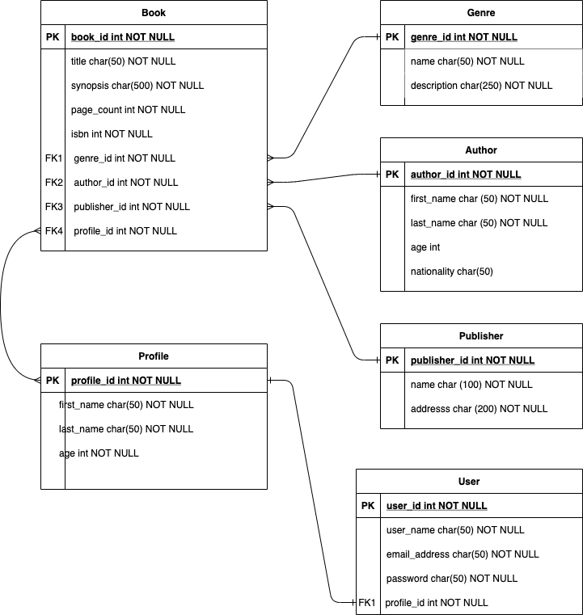

# Bookkeeper Application with Java Spring Boot

Welcome to Bookkeeper - with this app, you can help us forge a massive database
of books, authors, genres, and publishers! All information is publicly available
through our GET endpoints listed below. To contribute to the database, as well
as maintain your own list of favorite books, you will need to register as a user.

### Workflow

The workflow starts with checking our database to what information is required. Duplicate 
entries are not allowed. If you are adding a book that has an author, genre, and/or
publisher that does not already exist in the database, those items will need to be
added prior to the book, as the book object requires each of those items in order to
successfully add the item to our database.

You can browse through all books or find a specific one through the ID in our database. Additionally,
you can filter your search by a specific author, genre, or publisher. If you would like
to save a book to your favorites list, simply specify which book by its ID through the 
favorite endpoint. You will need to be logged in to do so, as well as have created a profile
for your account for the favorites to save to your list. You can view this list at anytime
through the View Profile endpoint.

### Relational Diagram

Before starting this project, we determined that we wanted our API's main entities to
maintain independence of each other's endpoints. In other words, we did not want to have
to access all books by accessing their specific genre first. To visualize this, we created
an ERD diagram, which we have included below.

## API Endpoints
| http method |Endpoint |Functionality| Access|  Header |   Body    |  
| ------ | ------ | ------ | ------ | ------ | ------ |
|POST| /auth/users/register  |  Create user | Public  | - |  "userName", "emailAddress", "password" |
|POST| /auth/users/login |  User login to generate JWT Token | Public  | - |  "userName" , "password" |
|POST| /auth/users/createProfile  |  Create user Profile based on UserToken | Private  |Authorization : Bearer {{JWTToken}}| "firstName", "lastName", "age"  |
|GET| /auth/users/viewProfile  |  View User Profile based on UserToken | Private  |Authorization : Bearer {{JWTToken}}| - |
|PUT| /auth/users/updatePassword  |  User Update Password | Private  | Authorization : Bearer {{JWTToken}} |  "userName", "password" |
|GET| /api/books  |  List all books | public  | - | - |
|GET|  /api/books/{id}  |  Gets a single category with the supplied id | public  | - | - |
|POST| /api/books|Creates a new category|Private | Authorization : Bearer {{JWTToken}} |  "title", "synopsis",  "pageCount",  "isbn",  "genre_name",  "author_first_name", "author_last_name",  "publisher_name"  |
|PUT| /api/books/{id}|Updates a book with the supplied id |Private | Authorization : Bearer {{JWTToken}} | "title", "synopsis",  "pageCount",  "isbn",  "genre_name",  "author_first_name", "author_last_name",  "publisher_name"  |
|DELETE| /api/books/{id}|Delete a book with the supplied id |Private | Authorization : Bearer {{JWTToken}} | -|
|POST| /api/books/{bookId}/favorite  |  List all books favorite books | Private  | Authorization : Bearer {{JWTToken}} | - |
|GET| /api/authors | List all the authors |public |  - | - |
|GET| /api/authors/{id}|Gets a single author with the supplied id |Public |-| - |
|POST| /api/authors|Creates a new author |Private |Authorization : Bearer {{JWTToken}} | "firstName",  "lastName",  "age", "nationality" |
|DELETE| /api/authors/{id}|Delete a author with the supplied id |Private | Authorization : Bearer {{JWTToken}}  | - |
|GET| /api/authors/{authorId}/allBooks  |  List all books favorite books relate to author | Private  | Authorization : Bearer {{JWTToken}} | - |
|GET| /api/genres|List all the genres |Public | -| - |
|GET| /api/genres/{id}|Gets a single genres with the supplied id |public | -| - |
|POST| /api/genres|Creates a new genres |Private | Authorization : Bearer {{JWTToken}} | "name",  "description"  |
|DELETE| /api/authors/{id}|Delete a genres with the supplied id |Private | Authorization : Bearer {{JWTToken}} | -|
|GET| /api/genres/{genreId}/allBooks  |  List all books favorite books relate to genre | Private  | Authorization : Bearer {{JWTToken}} | - |
|GET| /api/publishers|List all the publishers |Public | -| -|
|GET| /api/publishers/{id}|Gets a single publishers with the supplied id |Public |- |-|
|POST| /api/publishers|Creates a new publishers |Private|Authorization : Bearer {{JWTToken}} | "name",  "description" |
|DELETE| /api/publishers/{id}|Delete a publishers with the supplied id |Private|Authorization : Bearer {{JWTToken}} |-|
|GET| /api/publishers/{publisherId}/allBooks  |  List all books favorite books relate to publisher | Private  | Authorization : Bearer {{JWTToken}} | - |

### How to run Api Locally
1. Clone repository from: https://github.com/jackcurtin/project_2_bookkeeper
1. Open Folder in IntelliJ 
1. Click on run button.
   This should start the Api project.
   
### Personal Experience
Personally for us, this was a great introduction to pair programming. We were able to 
take care of most of the main responsibilities during the first two days of collaboration.
During this time, we would mainly code together or work on remote branches while
still communicating about what we were doing. As the week went on and we expanded into
"extra-features" territory, we worked more independently, while coming together at the beginning
and end of most big processes, ensuring that our branches merged successfully. This was
a great opportunity for us to learn about working with Git in more detail, as well as
get more comfortable with pair programming in general.
   

